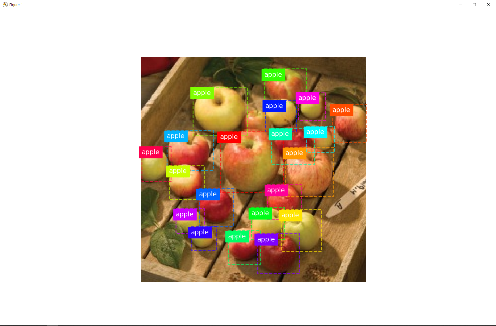
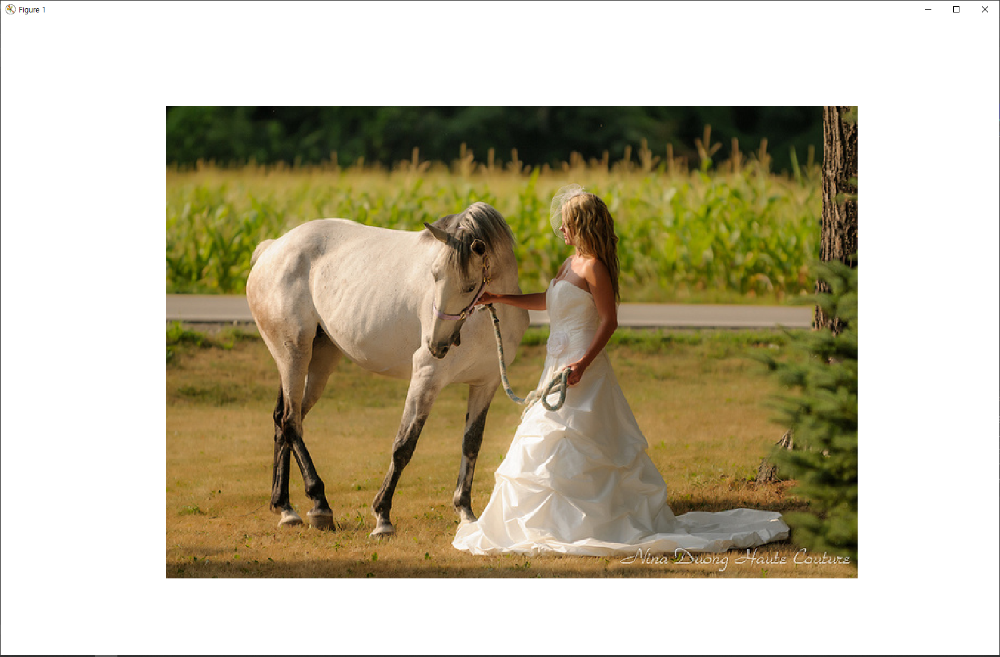
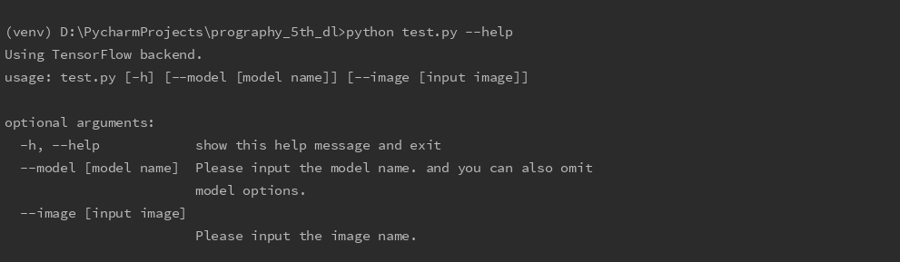

# prography_5th_dl
프로그라피 5기 지원자 홍예지

## Summary of assiginment
+ Project : 냉장고 속 물체 탐지(Object Detection in refrigerator)

+ Framework : `Keras`
+ Detection Network : `Mask RCNN`
+ Network Structure
    1. Multi Classification Model (Categorize of 6 categories)
    2. Binary Classification Model (Find object)
    3. Regression Model (Calculate bbox position)

## Result
+ Input
   - `python test.py --model mask_rcnn_refri_cfg_0030.h5 --image apple_0068.jpg` 
   
   - 혹은 model 옵션 생략 가능
   
        `python test.py --image apple_0068.jpg`

+ Result
    - Object detection result
    
        
    
    - Results when inserting unrelated pictures
    
        
    
* Note: Command line options

## Implementations
+ `mask_rcnn_refri_cfg_0030.h5`
    - Training description
        - Data size
            - train size : 1341, validation size : 169
        - Generator sample size
            - 1 * 1341 (batch_size * steps_per_epoch)
        - Epoch : 30
        - Learning time : 1d
    - [Download my trained model (mask_rcnn_refri_cfg_0030.h5)](https://drive.google.com/open?id=1aKaF9Zu095W32YxAEte9v1_FCJUAky9m) _*파일 경로 : "refri_cfg20190902T0621/here"_
    - This model has learned `detection_dataset` in the existing `mask_rcnn_coco.h5` model 
    [Download Weights (mask_rcnn_coco.h5)](https://github.com/matterport/Mask_RCNN/releases/download/v2.0/mask_rcnn_coco.h5) _*파일 경로 : "./here" (root directory)_
        
+ `test.py`
    - **Accurcy**
        - Train mAP: 0.921
        - Test mAP: 0.810 
    - Training codes and Testing codes are integrated into a single file
    - Can handle command line args
    - Added `my_display_instances` func to `mrcnn/visualize.py`
+ `csv_to_xml.py`
    - Make an absolute coordinate for use in the bbox
    - Convert .csv to .xml and create new files at each `refri_dataset/.../annots/` folder
    - `csv_to_xml()` func is used in line 220 of `test.py`
    
## References
- [Mask RCNN Project, GitHub.](https://github.com/matterport/Mask_RCNN)
- [Mask R-CNN, 2017, Paper.](https://arxiv.org/abs/1703.06870)